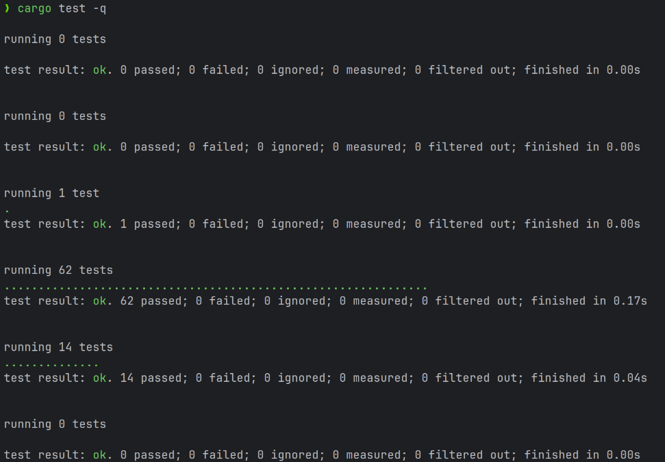

# Lox to LLVM compiler


## Authors
Project made for university course by:
- Wiktor Janecki: wjanecki@student.agh.edu.pl
- Dmytro Harasiuk: harasiuk@student.agh.edu.pl

## Project description

- input - Lox
- output - LLVM
- parser generator - [**LALRPOP**](https://github.com/lalrpop/lalrpop)
- language of implementation - Rust
- error handling - runtime errors (e.g. adding string and number), compile-time errors (e.g. using undeclared variable), parsing errors 

Lox is functional and objective script language designed by Robert Nystrom in his book - Crafting Interpreters. 

### Tests
Project is heavly tested. Tens of tests for every edge case f.ex dangling else or lox specification related things


## Syntax Grammar
Parser generator file: [grammar.lalrpop](src/grammar.lalrpop)
```lox
program        → declaration* EOF ;

declaration    → classDecl
               | funDecl
               | varDecl
               | statement ;

classDecl      → "class" IDENTIFIER ( "<" IDENTIFIER )?
                 "{" function* "}" ;
funDecl        → "fun" function ;
varDecl        → "var" IDENTIFIER ( "=" expression )? ";" ;

statement      → exprStmt
               | forStmt
               | ifStmt
               | printStmt
               | returnStmt
               | whileStmt
               | block ;

exprStmt       → expression ";" ;
forStmt        → "for" "(" ( varDecl | exprStmt | ";" )
                           expression? ";"
                           expression? ")" statement ;
ifStmt         → "if" "(" expression ")" statement
                 ( "else" statement )? ;
printStmt      → "print" expression ";" ;
returnStmt     → "return" expression? ";" ;
whileStmt      → "while" "(" expression ")" statement ;
block          → "{" declaration* "}" ;


expression     → assignment ;

assignment     → ( call "." )? IDENTIFIER "=" assignment
               | logic_or ;

logic_or       → logic_and ( "or" logic_and )* ;
logic_and      → equality ( "and" equality )* ;
equality       → comparison ( ( "!=" | "==" ) comparison )* ;
comparison     → term ( ( ">" | ">=" | "<" | "<=" ) term )* ;
term           → factor ( ( "-" | "+" ) factor )* ;
factor         → unary ( ( "/" | "*" ) unary )* ;

unary          → ( "!" | "-" ) unary | call ;
call           → primary ( "(" arguments? ")" | "." IDENTIFIER )* ;
primary        → "true" | "false" | "nil" | "this"
               | NUMBER | STRING | IDENTIFIER | "(" expression ")"
               | "super" "." IDENTIFIER ;
               
function       → IDENTIFIER "(" parameters? ")" block ;
parameters     → IDENTIFIER ( "," IDENTIFIER )* ;
arguments      → expression ( "," expression )* ;

NUMBER         → DIGIT+ ( "." DIGIT+ )? ;
STRING         → "\"" <any char except "\"">* "\"" ;
IDENTIFIER     → ALPHA ( ALPHA | DIGIT )* ;
ALPHA          → "a" ... "z" | "A" ... "Z" | "_" ;
DIGIT          → "0" ... "9" ;
```

## Used libraries

- LARLPOP - parser generator
- Inkwell - LLVM generator

## Usage Instructions
Make sure you have [Rust](https://rust-lang.org/) toolchain installed and added to your PATH

Next install [LLVM-22.1](https://github.com/llvm/llvm-project/releases/tag/llvmorg-22.1.3) toolchain, add it to PATH and (only on windows) create environmental variable LLVM_SYS_221_PREFIX=toolchain_path.

Quick tip: for [some reason](https://github.com/llvm/llvm-project/issues/35139) official llvm prebuild binaries on windows don't come with llvm-config. You need to build them by yourself. I spent too much time on this issue...

Finally, you can run compiler directly using cargo or build it and install in your system path
```bash
cargo run ./examples/hello_world.lox
```
```bash
cargo install --path .

loxc ./path_to_lox_script.lox
loxc <filename> <arguments>
```

Compiler by default emits executable with the same name as source file using following pipeline:
```
input.lox --> input.ll --> input.o --> input.exe
         loxc         llc         linker
```
This behaviour can be changed by following arguments:
- `-o filename` change output file name  
- `--emit=exe` change type of output file to executable (default)
- `--emit=llvm-ir` change type of output file to [LLVM IR](https://llvm.org/docs/LangRef.html)
- `--emit=obj` change type of output file to object files
- `--help` display all arguments and default values

Example:
```bash
loxc examples/hello_world.lox --emit-llvm-ir -o output.ll
```

## Example program
```
// ------------------------------------------
//                   BASICS
// ------------------------------------------

var a = 1;
{
    var a = 2;
    {
        var a = 3;
    }
    print a;
}

var concatenation = "first" + "second";
var nullByDefault;

if (2 + 2 <= 4) {} else { print "unreachable"; }

while (false) {}

fun max(a,b){
    if ( a > b){
        return a;
    }
    return b;
}

for (var i = 1; i < 5; i = i + 1) {
  print i * i;
}

// ------------------------------------------
//                    OOP
// ------------------------------------------

class IAnimal{}

class Duck < IAnimal{
  init(name) {
    this.name = name;
  }

  quack() {
    print this.name + " quacks";
  }
}

var duck = Duck("Waddles");
duck.quack();

// ------------------------------------------
//                CLOUSURES
// ------------------------------------------
fun make_adder(n) {
  fun adder(i) {
    return n + i;
  }
  return adder;
}
var add5 = make_adder(5);
print add5(1);
print add5(100);
```

More examples [here](https://github.com/WiktorJanecki/lox-compiler/blob/master/examples)

## Generated LLVM example

### Input
```
var a = 5 + 3;
```

### Output
```
; ModuleID = 'main'
source_filename = "main"
target triple = "x86_64-pc-linux-gnu"

@compiler_printf_literal = private unnamed_addr constant [4 x i8] c"%f\0A\00", align 1
@compiler_printf_literal.1 = private unnamed_addr constant [4 x i8] c"%s\0A\00", align 1
@compiler_printf_literal.2 = private unnamed_addr constant [5 x i8] c"nil\0A\00", align 1
@compiler_printf_literal.3 = private unnamed_addr constant [6 x i8] c"true\0A\00", align 1
@compiler_printf_literal.4 = private unnamed_addr constant [7 x i8] c"false\0A\00", align 1
@compiler_printf_literal.5 = private unnamed_addr constant [51 x i8] c"Runtime error: Mismatched types used on + operand\0A\00", align 1
@compiler_printf_literal.6 = private unnamed_addr constant [66 x i8] c"Runtime error: Only Number and string can be used with + operand\0A\00", align 1
@compiler_printf_literal.7 = private unnamed_addr constant [55 x i8] c"Runtime error: Only Number can be used with - operand\0A\00", align 1
@compiler_printf_literal.8 = private unnamed_addr constant [55 x i8] c"Runtime error: Only Number can be used with * operand\0A\00", align 1
@compiler_printf_literal.9 = private unnamed_addr constant [55 x i8] c"Runtime error: Only Number can be used with / operand\0A\00", align 1
@compiler_printf_literal.10 = private unnamed_addr constant [45 x i8] c"Runtime error: Only Numbers can be compared\0A\00", align 1
@compiler_printf_literal.11 = private unnamed_addr constant [63 x i8] c"Runtime error: Only booleans can be used in logical operators\0A\00", align 1
@compiler_printf_literal.12 = private unnamed_addr constant [40 x i8] c"Runtime error: Can only call functions\0A\00", align 1
@compiler_printf_literal.13 = private unnamed_addr constant [47 x i8] c"Runtime error: Only instances have properties\0A\00", align 1
@compiler_printf_literal.14 = private unnamed_addr constant [35 x i8] c"Runtime error: Undefined property\0A\00", align 1
@compiler_printf_literal.15 = private unnamed_addr constant [33 x i8] c"Runtime error: Undefined method\0A\00", align 1

declare i32 @printf(ptr, ...)

declare void @exit(i32)

declare ptr @malloc(i64)

declare ptr @realloc(ptr, i64)

declare i64 @strlen(ptr)

declare ptr @strcpy(ptr, ptr)

declare ptr @strcat(ptr, ptr)

declare i32 @strcmp(ptr, ptr)

define void @panic(ptr %0) {
entry:
  %_ = call i32 (ptr, ...) @printf(ptr %0)
  call void @exit(i32 -1)
  unreachable
}

define ptr @lox_get_field(ptr %0, ptr %1) {
entry:
  %n_fields_ptr = getelementptr inbounds nuw { ptr, i64, ptr, ptr }, ptr %0, i32 0, i32 1
  %n_fields = load i64, ptr %n_fields_ptr, align 4
  %names_ptr = getelementptr inbounds nuw { ptr, i64, ptr, ptr }, ptr %0, i32 0, i32 2
  %field_names = load ptr, ptr %names_ptr, align 8
  %vals_ptr = getelementptr inbounds nuw { ptr, i64, ptr, ptr }, ptr %0, i32 0, i32 3
  %fields = load ptr, ptr %vals_ptr, align 8
  %i = alloca i64, align 8
  store i64 0, ptr %i, align 4
  br label %loop_check

loop_check:                                       ; preds = %loop_body, %entry
  %i_val = load i64, ptr %i, align 4
  %done = icmp sge i64 %i_val, %n_fields
  br i1 %done, label %not_found, label %loop_body

loop_body:                                        ; preds = %loop_check
  %i_val2 = load i64, ptr %i, align 4
  %name_elem = getelementptr ptr, ptr %field_names, i64 %i_val2
  %name = load ptr, ptr %name_elem, align 8
  %cmp = call i32 @strcmp(ptr %name, ptr %1)
  %eq = icmp eq i32 %cmp, 0
  %next_i = add i64 %i_val2, 1
  store i64 %next_i, ptr %i, align 4
  br i1 %eq, label %found, label %loop_check

found:                                            ; preds = %loop_body
  %val_elem = getelementptr ptr, ptr %fields, i64 %i_val2
  %val_ptr = load ptr, ptr %val_elem, align 8
  ret ptr %val_ptr

not_found:                                        ; preds = %loop_check
  ret ptr null
}

define void @lox_set_field(ptr %0, ptr %1, ptr %2) {
entry:
  %nf_gep = getelementptr inbounds nuw { ptr, i64, ptr, ptr }, ptr %0, i32 0, i32 1
  %n_fields = load i64, ptr %nf_gep, align 4
  %ng_gep = getelementptr inbounds nuw { ptr, i64, ptr, ptr }, ptr %0, i32 0, i32 2
  %field_names = load ptr, ptr %ng_gep, align 8
  %vg_gep = getelementptr inbounds nuw { ptr, i64, ptr, ptr }, ptr %0, i32 0, i32 3
  %fields = load ptr, ptr %vg_gep, align 8
  %i = alloca i64, align 8
  store i64 0, ptr %i, align 4
  br label %loop_check

loop_check:                                       ; preds = %loop_body, %entry
  %i_val = load i64, ptr %i, align 4
  %done = icmp sge i64 %i_val, %n_fields
  br i1 %done, label %add_new, label %loop_body

loop_body:                                        ; preds = %loop_check
  %i_val2 = load i64, ptr %i, align 4
  %name_elem = getelementptr ptr, ptr %field_names, i64 %i_val2
  %name = load ptr, ptr %name_elem, align 8
  %cmp = call i32 @strcmp(ptr %name, ptr %1)
  %eq = icmp eq i32 %cmp, 0
  %next_i = add i64 %i_val2, 1
  store i64 %next_i, ptr %i, align 4
  br i1 %eq, label %found, label %loop_check

found:                                            ; preds = %loop_body
  %val_elem = getelementptr ptr, ptr %fields, i64 %i_val2
  store ptr %2, ptr %val_elem, align 8
  ret void

add_new:                                          ; preds = %loop_check
  %new_n = add i64 %n_fields, 1
  %new_names_size = mul i64 %new_n, 8
  %new_names = call ptr @realloc(ptr %field_names, i64 %new_names_size)
  %name_len = call i64 @strlen(ptr %1)
  %name_buf_size = add i64 %name_len, 1
  %name_copy = call ptr @malloc(i64 %name_buf_size)
  %_ = call ptr @strcpy(ptr %name_copy, ptr %1)
  %new_name_slot = getelementptr ptr, ptr %new_names, i64 %n_fields
  store ptr %name_copy, ptr %new_name_slot, align 8
  %new_vals_size = mul i64 %new_n, 8
  %new_vals = call ptr @realloc(ptr %fields, i64 %new_vals_size)
  %new_val_slot = getelementptr ptr, ptr %new_vals, i64 %n_fields
  store ptr %2, ptr %new_val_slot, align 8
  store i64 %new_n, ptr %nf_gep, align 4
  store ptr %new_names, ptr %ng_gep, align 8
  store ptr %new_vals, ptr %vg_gep, align 8
  ret void
}

define ptr @lox_get_method(ptr %0, ptr %1) {
entry:
  %i = alloca i64, align 8
  %is_null = icmp eq ptr %0, null
  br i1 %is_null, label %not_found, label %null_check

null_check:                                       ; preds = %entry
  %nm_ptr = getelementptr inbounds nuw { ptr, ptr, i64, ptr, ptr }, ptr %0, i32 0, i32 2
  %n_methods = load i64, ptr %nm_ptr, align 4
  %mn_ptr = getelementptr inbounds nuw { ptr, ptr, i64, ptr, ptr }, ptr %0, i32 0, i32 3
  %method_names = load ptr, ptr %mn_ptr, align 8
  %mp_ptr = getelementptr inbounds nuw { ptr, ptr, i64, ptr, ptr }, ptr %0, i32 0, i32 4
  %methods = load ptr, ptr %mp_ptr, align 8
  store i64 0, ptr %i, align 4
  br label %loop_check

loop_check:                                       ; preds = %loop_body, %null_check
  %i_val = load i64, ptr %i, align 4
  %done = icmp sge i64 %i_val, %n_methods
  br i1 %done, label %try_super, label %loop_body

loop_body:                                        ; preds = %loop_check
  %i_val2 = load i64, ptr %i, align 4
  %name_elem = getelementptr ptr, ptr %method_names, i64 %i_val2
  %name = load ptr, ptr %name_elem, align 8
  %cmp = call i32 @strcmp(ptr %name, ptr %1)
  %eq = icmp eq i32 %cmp, 0
  %next_i = add i64 %i_val2, 1
  store i64 %next_i, ptr %i, align 4
  br i1 %eq, label %found, label %loop_check

found:                                            ; preds = %loop_body
  %val_elem = getelementptr ptr, ptr %methods, i64 %i_val2
  %method_lox_val = load ptr, ptr %val_elem, align 8
  ret ptr %method_lox_val

try_super:                                        ; preds = %loop_check
  %super_ptr_gep = getelementptr inbounds nuw { ptr, ptr, i64, ptr, ptr }, ptr %0, i32 0, i32 1
  %super_ptr = load ptr, ptr %super_ptr_gep, align 8
  %super_result = call ptr @lox_get_method(ptr %super_ptr, ptr %1)
  ret ptr %super_result

not_found:                                        ; preds = %entry
  ret ptr null
}

define i32 @main() {
entry:
  %lox_val7 = alloca <{ i8, i64 }>, align 8
  %lox_val1 = alloca <{ i8, i64 }>, align 8
  %lox_val = alloca <{ i8, i64 }>, align 8
  %index = getelementptr inbounds nuw <{ i8, i64 }>, ptr %lox_val, i32 0, i32 0
  store i8 1, ptr %index, align 1
  %union = getelementptr inbounds nuw <{ i8, i64 }>, ptr %lox_val, i32 0, i32 1
  store double 5.000000e+00, ptr %union, align 8
  %index2 = getelementptr inbounds nuw <{ i8, i64 }>, ptr %lox_val1, i32 0, i32 0
  store i8 1, ptr %index2, align 1
  %union3 = getelementptr inbounds nuw <{ i8, i64 }>, ptr %lox_val1, i32 0, i32 1
  store double 3.000000e+00, ptr %union3, align 8
  %left_tag_ptr = getelementptr inbounds nuw <{ i8, i64 }>, ptr %lox_val, i32 0, i32 0
  %left_union_ptr = getelementptr inbounds nuw <{ i8, i64 }>, ptr %lox_val, i32 0, i32 1
  %left_tag = load i8, ptr %left_tag_ptr, align 1
  %left_tag_ptr4 = getelementptr inbounds nuw <{ i8, i64 }>, ptr %lox_val1, i32 0, i32 0
  %left_union_ptr5 = getelementptr inbounds nuw <{ i8, i64 }>, ptr %lox_val1, i32 0, i32 1
  %left_tag6 = load i8, ptr %left_tag_ptr4, align 1
  %comp_tags = icmp eq i8 %left_tag, %left_tag6
  br i1 %comp_tags, label %add.cmp.types.passed, label %print.panic.mismatched

print.number:                                     ; preds = %add.cmp.types.passed
  %left_fval = load double, ptr %left_union_ptr, align 8
  %right_fval = load double, ptr %left_union_ptr5, align 8
  %sum_fval = fadd double %left_fval, %right_fval
  %index_ptr = getelementptr inbounds nuw <{ i8, i64 }>, ptr %lox_val7, i32 0, i32 0
  %union_ptr = getelementptr inbounds nuw <{ i8, i64 }>, ptr %lox_val7, i32 0, i32 1
  store i8 1, ptr %index_ptr, align 1
  store double %sum_fval, ptr %union_ptr, align 8
  br label %print.merge

print.string:                                     ; preds = %add.cmp.types.passed
  %left_str = load ptr, ptr %left_union_ptr, align 8
  %right_str = load ptr, ptr %left_union_ptr5, align 8
  %left_len = call i64 @strlen(ptr %left_str)
  %right_len = call i64 @strlen(ptr %right_str)
  %total_len = add i64 %left_len, %right_len
  %total_plus_one = add i64 %total_len, 1
  %concat_buf = call ptr @malloc(i64 %total_plus_one)
  %_ = call ptr @strcpy(ptr %concat_buf, ptr %left_str)
  %_9 = call ptr @strcat(ptr %concat_buf, ptr %right_str)
  %index_ptr10 = getelementptr inbounds nuw <{ i8, i64 }>, ptr %lox_val7, i32 0, i32 0
  %union_ptr11 = getelementptr inbounds nuw <{ i8, i64 }>, ptr %lox_val7, i32 0, i32 1
  store i8 3, ptr %index_ptr10, align 1
  store ptr %concat_buf, ptr %union_ptr11, align 8
  br label %print.merge

print.merge:                                      ; preds = %print.string, %print.number
  %copy = load <{ i8, i64 }>, ptr %lox_val7, align 1
  %heap_lox = call ptr @malloc(i64 ptrtoint (ptr getelementptr (<{ i8, i64 }>, ptr null, i32 1) to i64))
  %index12 = getelementptr inbounds nuw <{ i8, i64 }>, ptr %heap_lox, i32 0, i32 0
  store i8 0, ptr %index12, align 1
  store <{ i8, i64 }> %copy, ptr %heap_lox, align 1
  ret i32 0

print.unreach:                                    ; preds = %add.cmp.types.passed
  unreachable

print.panic.mismatched:                           ; preds = %entry
  call void @panic(ptr @compiler_printf_literal.5)
  unreachable

print.panic.unsupported:                          ; preds = %add.cmp.types.passed, %add.cmp.types.passed, %add.cmp.types.passed, %add.cmp.types.passed, %add.cmp.types.passed
  call void @panic(ptr @compiler_printf_literal.6)
  unreachable

add.cmp.types.passed:                             ; preds = %entry
  %index8 = getelementptr inbounds nuw <{ i8, i64 }>, ptr %lox_val7, i32 0, i32 0
  store i8 0, ptr %index8, align 1
  switch i8 %left_tag, label %print.unreach [
    i8 3, label %print.string
    i8 1, label %print.number
    i8 2, label %print.panic.unsupported
    i8 0, label %print.panic.unsupported
    i8 4, label %print.panic.unsupported
    i8 5, label %print.panic.unsupported
    i8 6, label %print.panic.unsupported
  ]
}
```
